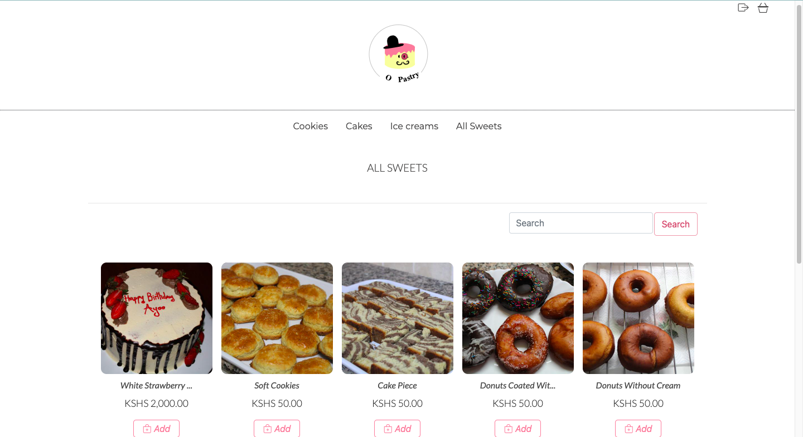
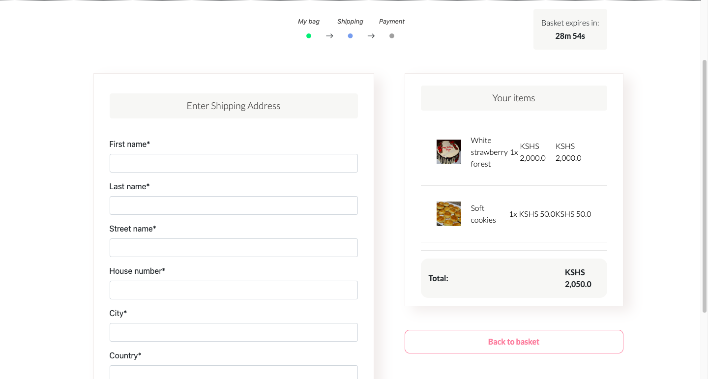
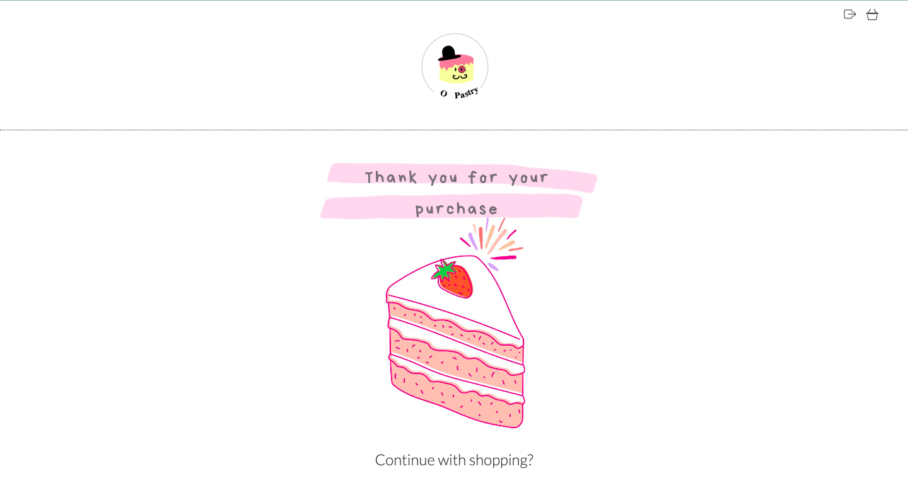
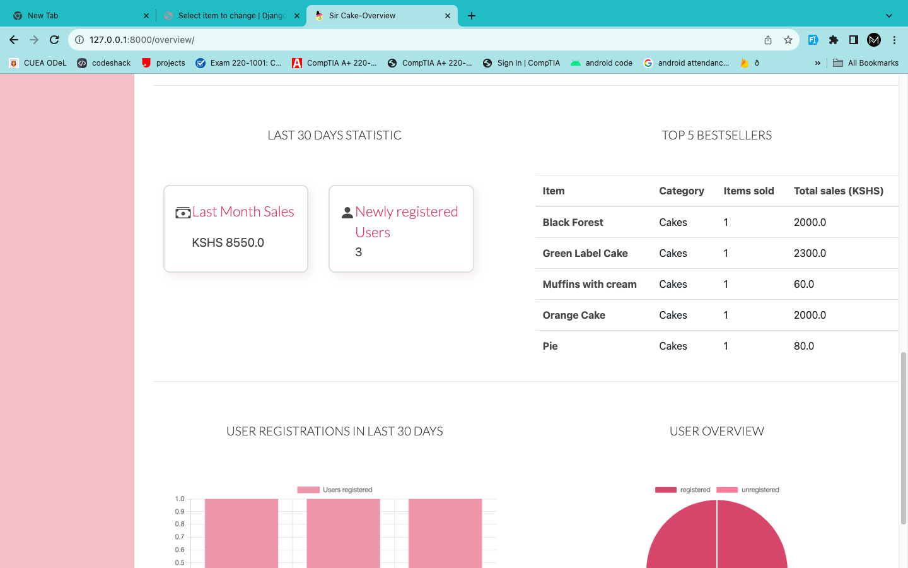
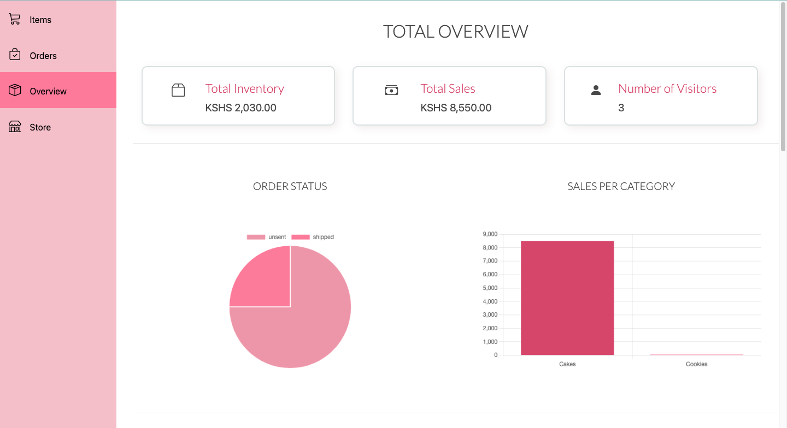
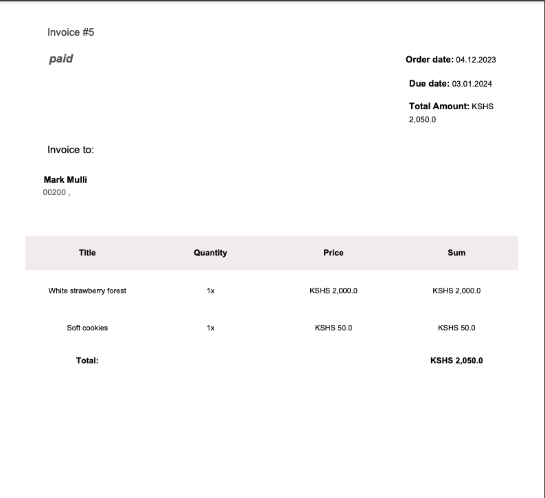

# Baking Pastry System

*A Django web based application.*

The online pastry shop system is an easy-to-use platform that allows customers to browse and buy a variety of pastries. Users can register for an account, browse an appealing catalogue with detailed product information, and add items to their shopping cart. The shopping cart displays a summary of the items selected and allows users to modify their orders. Customers can select from a variety of secure payment options during the checkout process.

## Table of Contents

1. [Tech Stack](#tech-stack)
1. [Mockups](#mockups)

## Tech Stack

### Front End

1. HTML
1. CSS
1. JAVASCRIPT

### Back End

1. Django Framework

### Database 

1. MySQL

## Mockups
### Home Page

  

### Payment Details Page

  

### Success Purchase Page

  

### Overview of orders (Admin)

  

### Statistics (Admin)

  

### Order Report (Admin)

  

